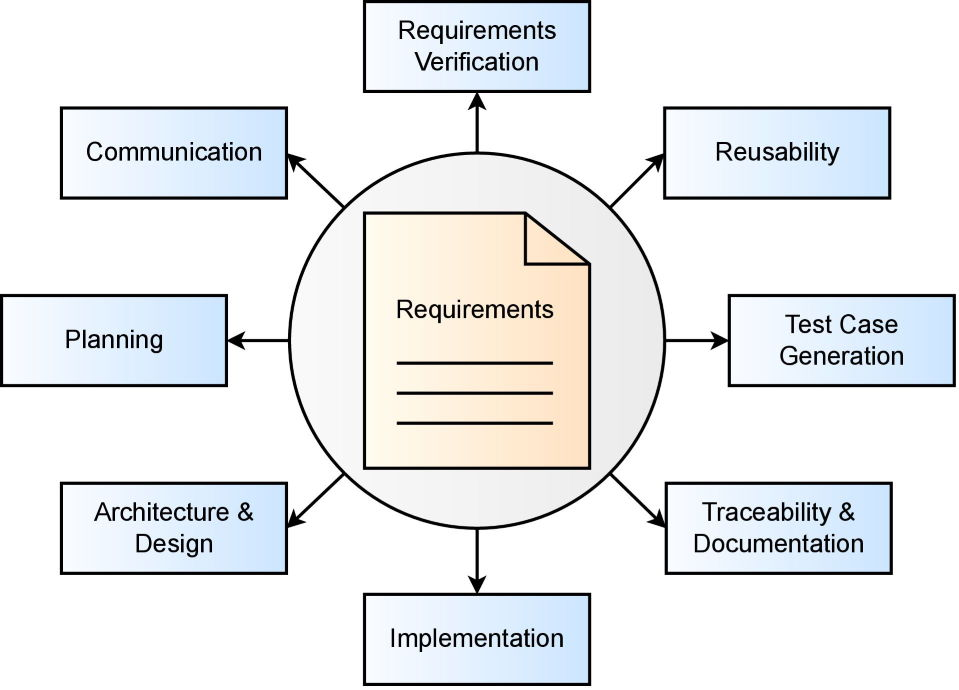
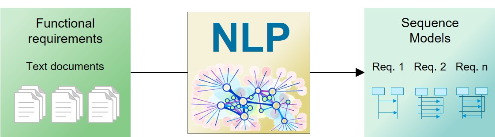
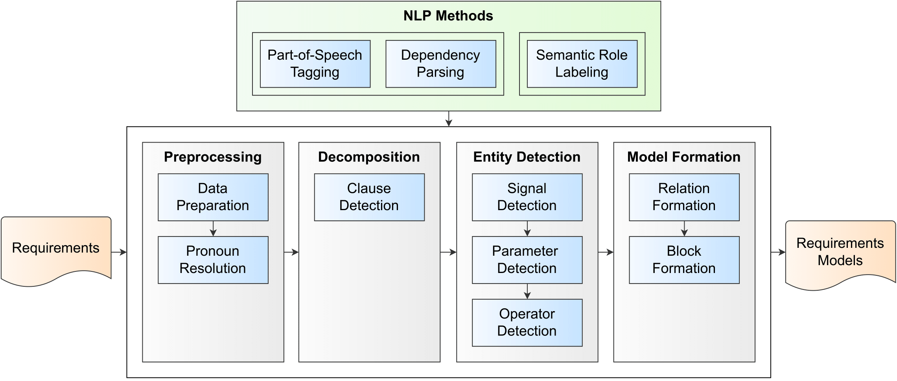

# ReForm: Automated Requirements Formalization using Natural Language Processing

## Motivation

Automated **formalization** of software requirements in natural language is helpful for
- Requirements Verification
- Reusability
- Test Case Generation
- much more...

  

It strongly supports **manual work**, which requires expert knowledge, is very time-consuming and error-prone.

## Entities

In order to generate requirement models from textual requirements, we need to **extract information** about
- components
- signals (input/output)
- parameters (boolean/integer/real)
- operators (larger/smaller/equal, and/or)
- temporal logic (if/then/else)

As an **output format**, we use a simple domain specific language (DSL) describing temporal logic. It can be mapped to other requirement and model languages such as
- UML diagrams (sequence diagrams, state machines, etc.)
- Matlab Simulink models
- OCL constraints
- TeAL (Temporal Action Language)
- Petri nets
- FRETISH/SOPHIST/EARS templates

  

## Methodologies

We focus on principal ideas and state-of-the-art methodologies from the field of Natural Language Processing (NLP) to automatically generate requirements models from natural language requirements. We iteratively derive a set of rules based on NLP information to demonstrate how you can create your own rules and methods according to your specific use cases and needs. We use the following three NLP-based approaches:

- **Part-of-Speech Tagging** and **Dependency Parsing**: [pos_dep](nlp_reform_pos_dep)
- **Semantic Role Labeling**: [srl](nlp_reform_srl)
- **Semantic Similarity**: [sem_sim](nlp_reform_sem_sim)

Our approaches use the following general pipeline:

  

## Run the tool

We recommend **Python 3.8** or higher.

Install the required libraries by executing the command

`pip install -r requirements.txt`

Run the UI via your web browser by the following command

`streamlit run app.py`

## Tool Demo

An exemplary execution of the tool is shown below.
<!---

-->

## Citation

You can find detailed information about our approaches in the following publications:

[1] Gröpler, R., Sudhi, V., Calleja García, E.J., Bergmann, A.: **NLP-based requirements formalization
for automatic test case generation**. In: CS&P’21, CEUR-WS.org, pp. 18–30 (2021).
URL http://ceur-ws.org/Vol-2951/paper15.pdf

[2] Gröpler, R., Sudhi, V., Kutty, L., Smalley, D.: **Automated requirement formalization using
product design specifications**. In: NLP4RE’22, CEUR-WS.org (2022). URL http://ceur-ws.org/Vol-3122/NLP4RE-paper-1.pdf

[3] Gröpler, R., Sudhi, V., Kutty, L.: **Automatisierte Modell- und Testgenerierung aus textuellen Anforderungen**. In: AUTOMATION 2022, VDI, pp. 521–532 (2022). DOI http://dx.doi.org/10.51202/9783181023990-521

[4] Sudhi, V., Kutty, L., Gröpler, R.: **Natural Language Processing for Requirements Formalization: How to Derive New Approaches?** In: CS&P'21 Post-Proceedings, Springer. URL https://link.springer.com/chapter/10.1007/978-3-031-26651-5_1 
[Accepted](https://www2.informatik.hu-berlin.de/csp2021/proc.shtml)

The full text articles are also available on [ResearchGate](https://www.researchgate.net/profile/Robin-Groepler/research). Please also find [BibTex](fig/ReForm_references.bib) for citation.

## Acknowledgments

This research was funded by the German Federal Ministry of Education and Research (BMBF) within the ITEA projects [XIVT](https://itea4.org/project/xivt.html) (grant no. 01IS18059E) and [SmartDelta](https://itea4.org/project/smartdelta.html) (grant no. 01IS21083E). We thank **AKKA** Germany GmbH and **Bombardier Transportation**, an Alstom Group Company, for providing industrial use cases for the demonstration of the presented methods.

## Contact

Don't hesitate to e-mail us, if you have any questions or would like to use the tool.

**Contact person:** Robin Gröpler, [robin.groepler@ifak.eu](mailto:robin.groepler@ifak.eu)

ifak - Institut für Automation und Kommunikation e.V., Magdeburg, Germany

## License

This software is licensed under the open source license [MICROSOFT REFERENCE SOURCE LICENSE (MS-RSL)](LICENSE.md). If you want to use the code in another form, please contact us.